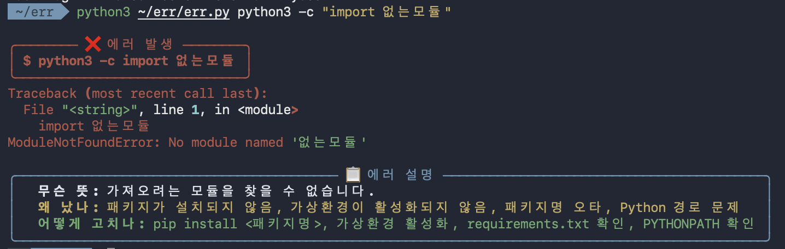

# err 🚨

터미널 명령어가 에러를 내면, 그 에러가 **무슨 뜻인지 / 왜 났는지 / 어떻게 고치는지**를 한국어로 예쁘게 설명해주는 CLI 도구입니다.

영어 에러 메시지가 무섭게 느껴지는 초보 개발자를 위해 만들었습니다.

## ✨ 기능

- 자주 나오는 에러 15개(403, 413, 429, `ModuleNotFoundError`, `SyntaxError` 등)는 내장 사전에서 **즉시** 설명
- 사전에 없는 처음 보는 에러는 **AI(NVIDIA NIM)**가 실시간으로 한국어 설명 생성
- `rich` 라이브러리로 색깔 입힌 보기 좋은 출력

## 📦 설치

    pip3 install --user rich

AI 설명 기능을 쓰려면 NVIDIA API 키가 필요합니다 (없어도 사전 기반 설명은 동작합니다):

    export NVIDIA_API_KEY="여기에_본인_키"

무료 키는 https://build.nvidia.com 에서 발급받을 수 있습니다.

## 🚀 사용법

    python3 err.py <명령어>

예시:

    python3 err.py python3 app.py

명령어가 에러를 내면, 원래 에러 메시지 아래에 한국어 설명이 색깔 박스로 표시됩니다.

## 🛠️ 만든 이유

에러 메시지가 전부 영어라서 막막했던 경험, 개발 처음 배울 때 다들 있잖아요. err은 그 에러를 한국어로, 초보자도 알아들을 수 있게 풀어줍니다.

## 📄 라이선스

MIT
